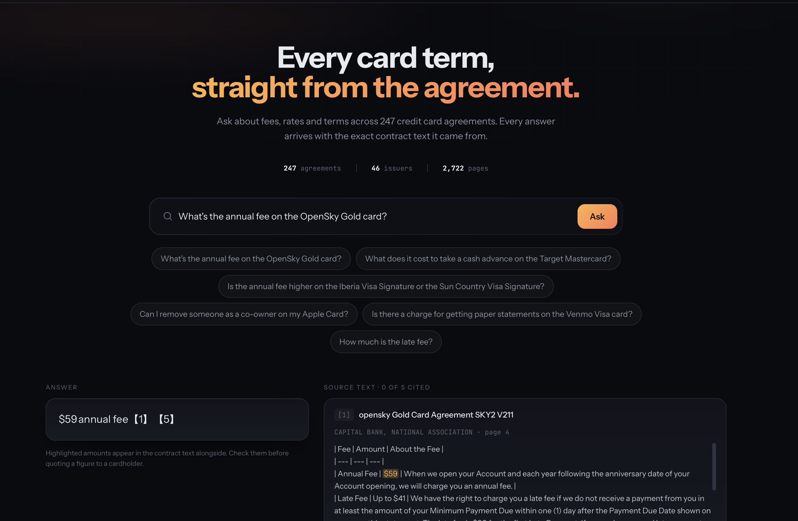
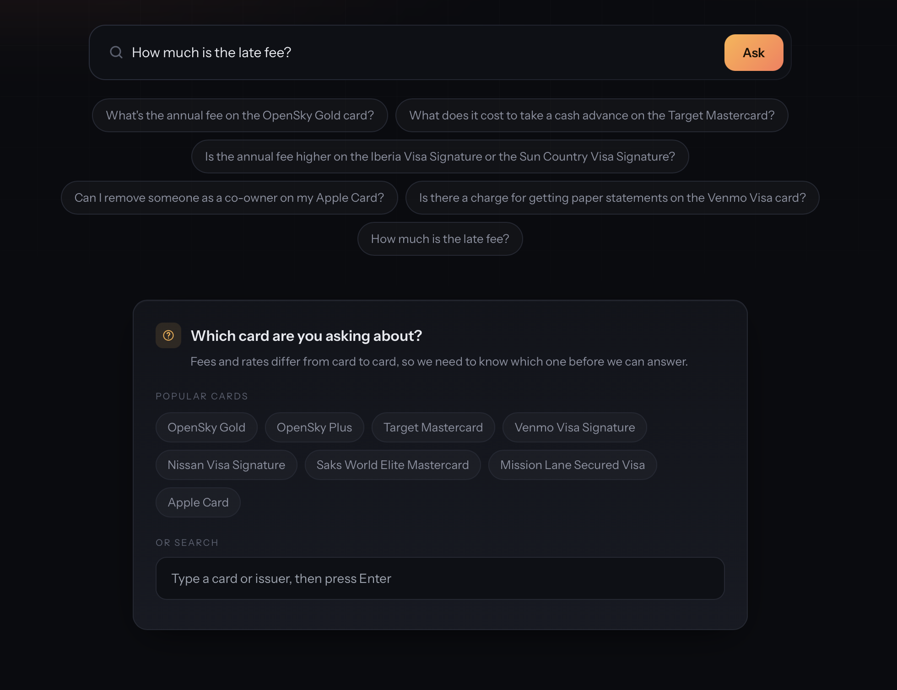
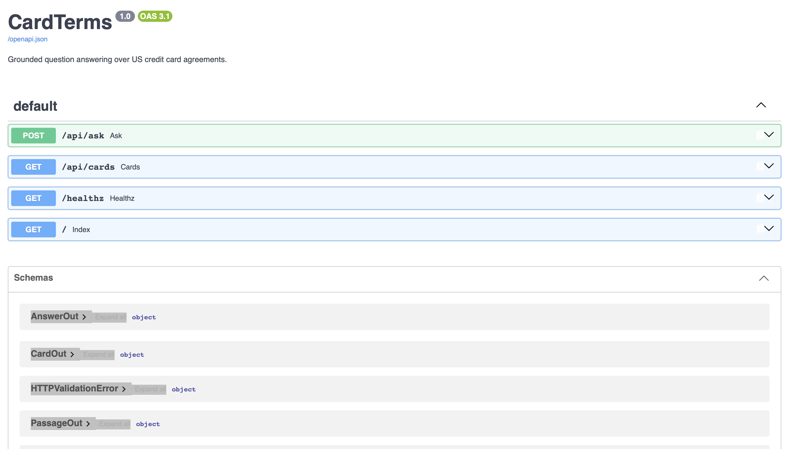

# CardTerms

Grounded question answering over 247 US credit card agreements filed with the
Consumer Financial Protection Bureau. Every answer is shown beside the contract
text it was drawn from.



Built end to end at zero cost: local models where they suffice, free-tier hosted
inference where they do not, and a measured comparison of the two.

## Results

Evaluated on 76 hand-written questions with span-level ground truth, including
15 that the corpus cannot answer.

| | |
|---|---|
| Answered correctly, end to end | **63 / 76 (82.9%)** |
| Correct document retrieved | 96.7% |
| Correct passage retrieved (hit@5) | 82.0% |
| Correctly declined when unanswerable | 14 / 15 |
| Wrong answers carrying a citation | 6 (7.9%) |
| Median response time | 7.7 s |
| Total cost | $0 |

Retrieval improved from a lexical baseline of 57.4% to 82.0% hit@5 across the
project, with every gain checked by paired significance testing.

## How it works

```
247 PDFs
  ↓  PyMuPDF, per-page OCR, cell-level table extraction
5,274 chunks (fixed 512 tokens)
  ↓  BM25 over text augmented with product and issuer
50 candidates
  ↓  bge-reranker-base cross-encoder
  ↓  entity-aware selection: reserve slots per card named
5 passages
  ↓  openai/gpt-oss-20b, grounding contract, two refusal tokens
answer + citations
```

Questions naming no card never reach the model. A detector built from the
corpus decides that in code and asks which card is meant.



## What the measurements showed

**A metric can hide a failure mode.** `hit_rate@k` counts a question as
answered the moment one relevant chunk arrives, so comparison questions scored
well while the model saw only one of two cards. Introducing an evidence-coverage
metric exposed a 23-point gap that the standard metric could not see.

**Automated correctness checks overstate accuracy.** Checking whether the
expected figure appears in an answer reported 91%. A judge calibrated against
30 hand-graded answers (Cohen's κ = 0.929) reported 68%. The cheap check cannot
distinguish "the annual fee is $59" from "$59 is the cash advance fee".

**Prompt engineering was the weakest lever available.** Three prompt revisions
were measured and two were rejected outright. What worked instead was moving one
decision out of the prompt into code, and changing the generator: a 3B model
corrected 0 of 11 known grounding failures, an 8B model corrected 8.

**The language model is not the bottleneck.** Profiling put generation at 9% of
response time and local cross-encoder reranking at 90%.

Three planned features were built, measured, and discarded on evidence:
approximate vector indexing, hybrid dense retrieval, and per-document caps on
context.

## Limitations

Six answers are wrong while citing a passage, which is why the interface always
shows the source text. Comparison questions remain the weakest category at 61%
evidence coverage. The hosted generator requires network access and is limited
to roughly 1.3 questions per minute on the free tier; a local fallback runs
offline at 69.7% accuracy and 40 seconds per question.

This is a prototype for a support agent to search agreements quickly, not a
system to answer cardholders without review.

## Running it

Requires Docker, Python 3.12, [uv](https://docs.astral.sh/uv/), and a free
[Groq](https://console.groq.com) API key.

```bash
uv sync
cp .env.example .env          # add GROQ_API_KEY
docker compose up -d          # Postgres with pgvector

uv run python scripts/init_db.py           # schema
uv run python scripts/build_manifest.py    # select 247 filings, record hashes
uv run python scripts/fetch_corpus.py      # download and verify against hashes
uv run python scripts/load_documents.py    # register documents
uv run python scripts/parse_documents.py   # text, OCR, tables (slow, ~20 min)
uv run python scripts/build_chunks.py      # 9 chunk sets
uv run python scripts/load_golden_set.py   # 76 questions, 105 span labels

uv run uvicorn cardterms.api:app --port 8000
```

Then open http://localhost:8000. First start takes 20 to 40 seconds while the
retrieval index and reranker load.

The generator is chosen at startup, so the local fallback needs no code change:

```bash
CARDTERMS_PROVIDER=ollama uv run uvicorn cardterms.api:app --port 8000
```

Interactive API documentation is at http://localhost:8000/docs.



To reproduce the reported evaluation:

```bash
uv run python scripts/run_eval.py --chunk-set fixed_512_ov0 \
    --rerank bge --candidates 50 --augment-rerank --entity-select \
    --generate --provider groq --gen-model openai/gpt-oss-20b \
    --prompt answer_v3 --clarify-gate
```

The application runs on the host rather than in a container: the reranker needs
GPU access, and a container would fall back to CPU.

## Repository

```
src/cardterms/
  ingest/      PDF parsing, OCR, table extraction, product name resolution
  chunk/       chunking strategies over a single canonical tokenizer
  retrieve/    BM25, dense, reranking, entity detection and selection
  generate/    context assembly, grounded answering, mechanical validation
  eval/        metrics, relevance resolution, significance tests, LLM client
  service.py   the pipeline as one callable
  api.py       HTTP interface
scripts/       every step above, runnable and reproducible
prompts/       answer_v1 to v4 and the judge, including rejected versions
db/            schema migrations
data/eval/     76 questions, 105 span labels, judge and hand-graded verdicts
experiments/   lab notebook: every decision and why
web/           single-page client
```

- [REPORT.md](REPORT.md) — the engineering decisions and what justified them
- [experiments/NOTES.md](experiments/NOTES.md) — the full lab notebook

## Data

CFPB Credit Card Agreement Database, Q1 2026 quarterly release. The corpus is
committed as a manifest of SHA-256 hashes and a fetch script rather than as
PDFs, so reproduction is verified byte for byte.
